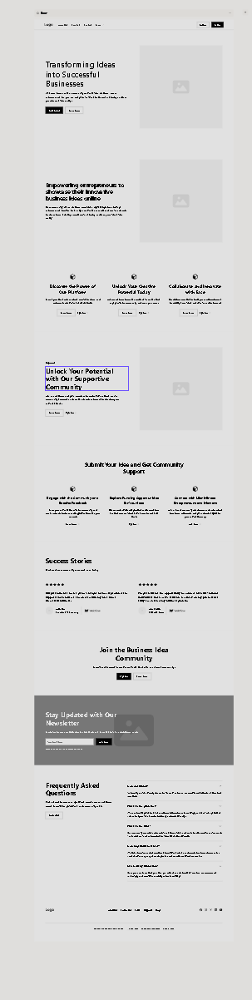

# MSP-3 Registered Interest

## Code Institute Milestone 3 Backend Development Project

[Live Site](https://registered-interest-7a4a9a21b59f.herokuapp.com/)

[Repository](https://github.com/jlewis-89/Milestone-Project-3/)

## Table of Contents
- [MSP-3 Registered Interest](#msp-3-registered-interest)
  - [Code Institute Milestone 3 Backend Development Project](#code-institute-milestone-3-backend-development-project)
  - [Table of Contents](#table-of-contents)
  - [Purpose](#purpose)
    - [The project - Registered Interest](#the-project---registered-interest)
  - [Project Goals](#project-goals)
  - [Developer Goals](#developer-goals)
  - [Tools \& Technologies Used](#tools--technologies-used)
    - [Software](#software)
    - [Frameworks](#frameworks)
  - [Design](#design)
    - [UI](#ui)
      - [Wireframes](#wireframes)
      - [Navigation](#navigation)
      - [Imagery](#imagery)
      - [Typography](#typography)
      - [Colour scheme - WebAIM Accessibility](#colour-scheme---webaim-accessibility)
    - [UX](#ux)
    - [Data Schema](#data-schema)
      - [JSON](#json)
  - [Features](#features)
  - [Features not yet implemented](#features-not-yet-implemented)
  - [Testing](#testing)
    - [Alpha Testing](#alpha-testing)
    - [Validators HTML/CSS/JS](#validators-htmlcssjs)
      - [HTML Validator \[https://validator.w3.org/\]](#html-validator-httpsvalidatorw3org)
      - [CSS Validator \[https://jigsaw.w3.org/css-validator/\]](#css-validator-httpsjigsaww3orgcss-validator)
      - [JS Hint Validator \[https://jshint.com/\]](#js-hint-validator-httpsjshintcom)
      - [Lighthouse Testing](#lighthouse-testing)
      - [Python PEP8 Compliance](#python-pep8-compliance)
    - [Bugs \& Fixes](#bugs--fixes)
  - [Deployment](#deployment)
    - [GitHub Pages](#github-pages)
    - [Forking the GitHub Repository](#forking-the-github-repository)
    - [Making a Local Clone](#making-a-local-clone)
    - [Deploying Your App to Heroku](#deploying-your-app-to-heroku)
      - [Overview](#overview)
      - [Prerequisites](#prerequisites)
      - [Steps to Deploy](#steps-to-deploy)
  - [Credit](#credit)
    - [Acknowledgement](#acknowledgement)
    - [Resources](#resources)
    - [Assets](#assets)
    - [Code Re-use](#code-re-use)
    - [Licensing](#licensing)
  - [Status](#status)


## Purpose
The purpose of the project is to develop a backend data based application using the Flask framework and MongoDB and to include full CRUD functionality.

### The project - Registered Interest
The purpose of this website is to enable users to litmus test their business ideas via a community posting board.
Users will be able to: 
- Register a profile
- Post their Business Ideas
- Edit and update their ideas but not other peoples
- Value their business ideas, and state whether they are currently seeking investment

## Project Goals
This project has been developed to meet the grading criteria of the Milestone 3 Project set out by Code Institute, and COBC.

The website was developed with the goals of:
- Performing full CRUD functionality in the ideas posting board
- Allowing users to register, login and logout of an account

## Developer Goals
- To gain experience using the Flask mini-framework
- To gain applicable knowledge and experience using then python language in web development
- To gain experience using the materialize styles framework

## Tools & Technologies Used
### Software
Figma
VS-Code
### Frameworks
Materialize Framework
Flask Framework
###Languages
HTML / CSS / JS / Python

## Design
### UI
#### Wireframes

#### Navigation
- Navbar taken from the Materialize CSS framework.
- Sitemap was built using figma tot ry and identify the maximum number of pages and understand the user requirements. This has been reduced due to restrictions on the project.

#### Imagery
- Logo imagery created by DALL.E 3 and the edited with MS Photo Editor
- Images Sourced from pexels.com
#### Typography
- Montserrat is a versatile and modern font with good readibility
- Roboto is a clean and widely used font that complements Montserrat well
#### Colour scheme - WebAIM Accessibility
- Navy Blue #001F3F - This colour represents trust and professionalism
- Teal #39CCCC - Adds a fresh and approachable tone 

### UX
As a user I want to be able to view all the ideas on the website
As a user I want to be able to create my own ideas and post them to the website
As a user I want to be able to edit and delete my ideas on the website
As a user I would like to be the only one who can edit or delte my ideas

### Data Schema
MongoDb was selected to provide the backend data storage due to the ease of use and available resources. I was also better able to integrate MongoDB into my IDE making it a better development choice.
* Users Collection:
* Attributes:
- username: A unique identifier for each user.
- password: The user’s password (hashed and salted for security).
* Ideas Collection:
* Attributes:
- description: A detailed description of the idea
- title: A concise title for the idea
- valuation: The estimated value or potential impact of the idea
- created by: The user who originated the idea
- invest: Would you invest in the idea Yes or No

#### JSON
{
  "users": [
    {
      "username": "string",
      "password": "string"
    }
  ],
  "ideas": [
    {
      "description": "string",
      "title": "string",
      "valuation": "number",
      "created_by": "reference to user",
      "invest": "Yes or No"
    }
  ]
}

## Features
The website features include:
- User profiles to register and login
- Ideas to view the community of ideas
- Create edit and delete users own ideas
- Mobile Navbar provided via materialze framework

## Features not yet implemented
These are features that have not been developed as part of the project but if the project is to contiue development beyond the purpose of this course I may wish to implement:
- Community feedback on ideas
- Full account management CRUD functionality
- Upvote and Downvote mechanism
- Save and monitor favorite ideas
- Contact Ideas creator via private message

## Testing
### Alpha Testing
Testing for functionality of navigation, usability, UI and UX, and CRUD functionality regarding the ideas / community pages has been carried out by the developer during production and by a number of close friends and family after the development process.

User story testing was conducted on the final project steps and has been verified to comply with the original statments;
Users are able to register an account, login and out. 
Users can add, edit and delete their own ideas but not other users. 
Users can view all ideas on the community page.

Feedback suggest the website looks abit plain - As the developer I accept this feedback as fair, but have chosen to invest more time in the functionailty than the appearance as the project timeline did not allow for further development of frontend appearances, this is something that could be developed oin further if the project is continued in the future.

### Validators HTML/CSS/JS
#### HTML Validator [https://validator.w3.org/]
Output from the HTML validator is shown below, it is note worthy that all the errors flagged by the validator relate specifically to the use of the Jinja templating language used throughout the web app and therefor cannot be rectified without impacting python functionality.

No further testing beyond functionality hsa been performed.

#### CSS Validator [https://jigsaw.w3.org/css-validator/]
Output from the CSS validator can be seen below

The use of the materialize framework meant that the styles.css file remained small. With no furhter errors found there was no more testing carried out.

#### JS Hint Validator [https://jshint.com/]
Output from the JSHint Javascript validator can be seen below:

The use of a single JQuery function to enable the navbar features is the only use of JS within this porject and therefore no further testing, beyond functionality is required.

#### Lighthouse Testing
Lighthouse testing was performed on the web app the results of which are shown below:


The use of JPG images contributes to the lower performance and accessibility crtiteria due to the increase use of data to render the image on the page, unfortunately no access to photo editing software capable of updating these images to a modern format was available, but this would be rectified if the project is progressed further in the future.

#### Python PEP8 Compliance
Python code has been checked for PEP8 compliance and formatted appropriately via the use of an IDE extension.

### Bugs & Fixes
- Numerous bugs where encountered when building the CRUD functionality, the most time demanding ones have been listed below.
- URL Not found for edit_users FIX: Corrected typo in route
- Update attributes not rendering on page FIX: Changed variable name as conflict was occuring
- Update error due to the use of update_one FIX: Used the Mongo method replace_one instead as this does not require variable to be pre-fixed with "$".

## Deployment
### GitHub Pages

The project was deployed to GitHub Pages using the following steps...

1. Log in to GitHub and locate the [GitHub Repository](https://github.com/)
2. At the top of the Repository (not top of page), locate the "Settings" Button on the menu.
   - Alternatively Click [Here](https://raw.githubusercontent.com/) for a GIF demonstrating the process starting from Step 2.
3. Scroll down the Settings page until you locate the "GitHub Pages" Section.
4. Under "Source", click the dropdown called "None" and select "Master Branch".
5. The page will automatically refresh.
6. Scroll back down through the page to locate the now published site [link](https://github.com) in the "GitHub Pages" section.

### Forking the GitHub Repository

    By forking the GitHub Repository we make a copy of the original repository on our GitHub account to view and/or make changes without affecting the original     repository by using the following steps...

    1. Log in to GitHub and locate the [GitHub Repository](https://github.com/)
    2. At the top of the Repository (not top of page) just above the "Settings" Button on the menu, locate the "Fork" Button.
    3. You should now have a copy of the original repository in your GitHub account.

### Making a Local Clone

1. Log in to GitHub and locate the [GitHub Repository](https://github.com/)
2. Under the repository name, click "Clone or download".
3. To clone the repository using HTTPS, under "Clone with HTTPS", copy the link.
4. Open Git Bash
5. Change the current working directory to the location where you want the cloned directory to be made.
6. Type `git clone`, and then paste the URL you copied in Step 3.

```
$ git clone https://github.com/YOUR-USERNAME/YOUR-REPOSITORY
```

7. Press Enter. Your local clone will be created.

```
$ git clone https://github.com/YOUR-USERNAME/YOUR-REPOSITORY
> Cloning into `CI-Clone`...
> remote: Counting objects: 10, done.
> remote: Compressing objects: 100% (8/8), done.
> remove: Total 10 (delta 1), reused 10 (delta 1)
> Unpacking objects: 100% (10/10), done.
```

Click [Here](https://help.github.com/en/github/creating-cloning-and-archiving-repositories/cloning-a-repository#cloning-a-repository-to-github-desktop) to retrieve pictures for some of the buttons and more detailed explanations of the above process.

### Deploying Your App to Heroku
#### Overview
This guide outlines the steps to deploy your application from a GitHub repository to Heroku. Heroku makes it easy to host and manage your web applications in the cloud.

#### Prerequisites
Before you begin, ensure you have the following:

- GitHub Account: Make sure you have a GitHub account where your code repository resides.
- Heroku Account: If you haven’t already, sign up for a Heroku account at Heroku.
- Heroku CLI: Install the Heroku Command Line Interface (CLI) on your local machine. You can download it from here.
#### Steps to Deploy
1. Set Up Your Heroku App
Log in to your Heroku account using the Heroku CLI:
heroku login

Create a new Heroku app (if you haven’t already):
heroku create <your-app-name>

2. Configure GitHub Integration
Go to your Heroku Dashboard and select your app.
Navigate to the Deploy tab.
Click on Connect to GitHub.
Authenticate with your GitHub account.
Search for your repository and connect it to your Heroku app.
3. Manual Deploys
To manually deploy your app, follow these steps:
Push your code changes to the desired branch in your GitHub repo.
In the Heroku Dashboard, go to the Deploy tab.
Under Manual Deploy, select the branch you want to deploy and click Deploy Branch.
4. Automatic Deploys
For automatic deploys:
In the Heroku Dashboard, go to the Deploy tab.
Under Automatic Deploys, choose the branch you want to auto-deploy.
Enable the option to wait for CI (Continuous Integration) to pass before deploying (if applicable).
5. Review Apps (Optional)
Heroku also supports Review Apps, which create a temporary app for each pull request. This allows you to test changes before merging them into the main branch.
6. Access Your Deployed App
Once deployed, your app will be accessible via the Heroku app URL (e.g., https://<your-app-name>.herokuapp.com).
Troubleshooting
If you encounter any issues during deployment, check the Heroku logs using:
heroku logs --tail

## Credit
### Acknowledgement
Code Institute Walkthrough Projects
My mentor Rohit for his input and guidance
COBC for their resources and guidance
### Resources
- Code Institute
- MongoDB Documentation
- OPEN AI's Chat-GPT for bug fixes
### Assets
Images Supplied by Pexels
Icons Supplied via Materialize framework
### Code Re-use
Code Institute - MongoDB Task Manager
### Licensing
None
## Status
Pending Review